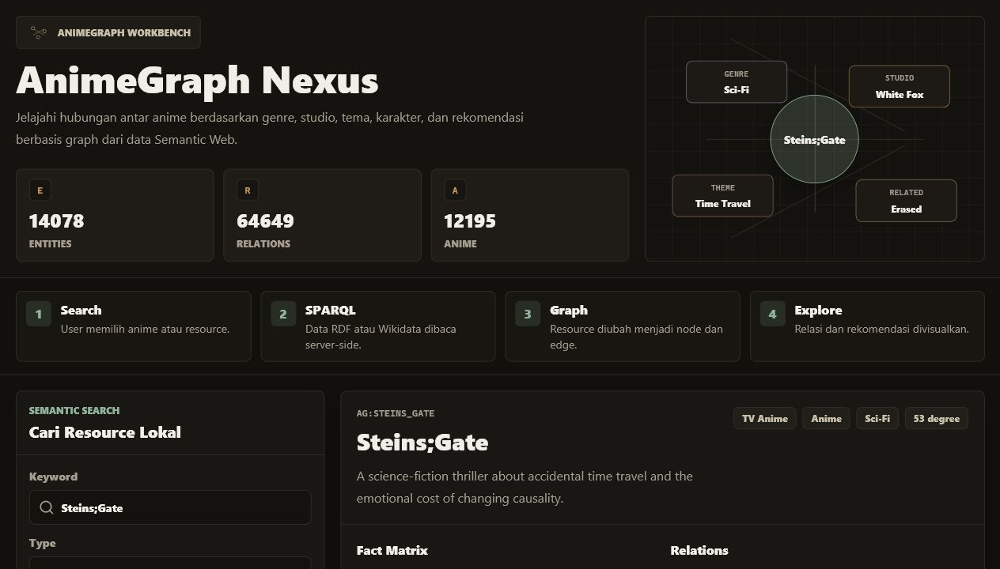
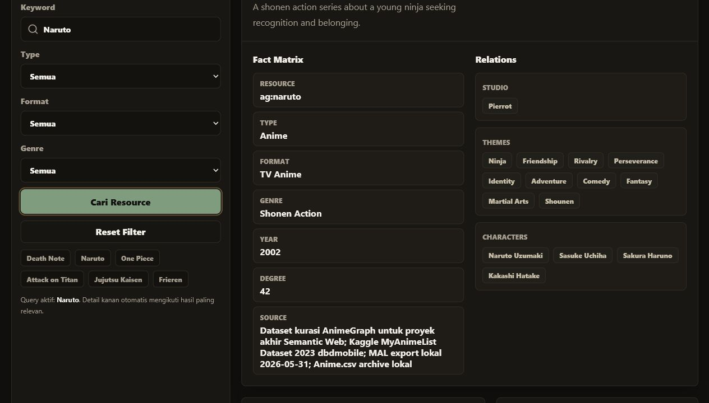

# AnimeGraph Nexus

AnimeGraph Nexus adalah aplikasi web React + Tailwind untuk eksplorasi data Semantic Web bertema anime. Aplikasi membaca RDF/Turtle lokal, mengubahnya menjadi JSON graph, lalu menyediakan semantic search, detail resource, graph neighborhood, grounded QA, semantic compare, dashboard statistik, dan demo query SPARQL berbasis data RDF-derived graph.

## Link RDF/Turtle

File RDF/Turtle utama tersedia di:

- Repository: `public/data/data.ttl`
- Raw GitHub: https://raw.githubusercontent.com/FreyjaRingo/Projek-Akhir-Semantik-Web-2026-230058_230081_230083/main/public/data/data.ttl

Kelompok lain dapat memakai link raw tersebut sebagai sumber RDF/Turtle.

## Struktur Proyek

```text
.
  Dataset/
    anime export 2026-05-31 14-55-48.zip
    anime-dataset-2023.csv.zip
    archive.zip
  public/data/
    data.ttl
    animegraph.json
  docs/screenshots/
    01-tampilan-utama.png
    02-pencarian-naruto.png
  scripts/
    sync-rdf-data.mjs
  src/
    App.jsx
    main.jsx
    styles.css
    lib/animegraph.js
  package.json
  vite.config.js
```

## Kebutuhan Sistem

- Node.js 20 atau lebih baru. Uji lokal terakhir memakai Node.js `v22.12.0`.
- npm. Uji lokal terakhir memakai npm `10.9.0`.
- Browser modern seperti Chrome, Edge, Firefox, atau Safari.

## Instalasi

1. Clone repository:

```bash
git clone https://github.com/FreyjaRingo/Projek-Akhir-Semantik-Web-2026-230058_230081_230083.git
cd Projek-Akhir-Semantik-Web-2026-230058_230081_230083
```

2. Install dependency:

```bash
npm install
```

3. Sinkronkan data RDF/Turtle menjadi JSON graph:

```bash
npm run sync:data
```

4. Jalankan aplikasi lokal:

```bash
npm run dev
```

5. Buka URL yang ditampilkan Vite, misalnya:

```text
http://127.0.0.1:5173/
```

Jika port 5173 sedang dipakai, Vite otomatis memakai port berikutnya, misalnya `http://127.0.0.1:5174/`.

## Build Produksi

```bash
npm run build
```

Perintah ini menjalankan `npm run sync:data` terlebih dahulu, lalu membuat output produksi di folder `dist/`.

## Panduan Penggunaan

1. Buka aplikasi lokal.
2. Gunakan panel **Cari Resource Lokal** untuk mencari anime, studio, genre, theme, atau resource lain. Contoh keyword: `Steins;Gate`, `Naruto`, `Death Note`, `MAPPA`.
3. Gunakan filter **Type**, **Format**, dan **Genre** untuk mempersempit hasil.
4. Klik salah satu kandidat hasil pencarian untuk membuka detail resource.
5. Baca **Fact Matrix** untuk metadata utama seperti resource, type, format, genre, year, degree, dan source.
6. Baca **Relations** untuk melihat studio, theme, character, dan relasi lain dari RDF graph.
7. Gunakan **Anime Correlation** untuk melihat anime yang mirip berdasarkan irisan relasi graph.
8. Gunakan **Semantic Compare** untuk membandingkan dua anime.
9. Gunakan **Tanya Graph** untuk bertanya dengan jawaban yang tetap grounded pada data graph. Contoh: `Apa tema Death Note?`
10. Gunakan **Query Lab** untuk mencoba template query SPARQL demo terhadap graph lokal.

Catatan: panel **Live SPARQL API / Search Wikidata** memanggil route `/api/sparql`. Untuk penggunaan lokal repository ini, fitur utama yang terverifikasi adalah pencarian dan eksplorasi RDF lokal. Route `/api/sparql` perlu tersedia di environment deployment jika ingin mengaktifkan pencarian live Wikidata.

## Cara Memperbarui RDF/Turtle

File utama RDF/Turtle ada di:

```text
public/data/data.ttl
```

Setelah mengubah file Turtle, jalankan:

```bash
npm run sync:data
npm run dev
```

Script `scripts/sync-rdf-data.mjs` akan membaca RDF/Turtle dan membuat ulang:

```text
public/data/animegraph.json
```

Jika dataset zip di folder `Dataset/` tersedia, script juga memperkaya graph dari dataset eksternal lokal.

## Uji RDF/Turtle Dari Kelompok Lain

Untuk mencoba RDF/Turtle dari kelompok lain:

1. Backup file RDF sendiri:

```bash
copy public\data\data.ttl public\data\data.backup.ttl
```

2. Ganti `public/data/data.ttl` dengan file `.ttl` dari kelompok lain.
3. Jalankan:

```bash
npm run sync:data
npm run dev
```

4. Buka aplikasi lokal dan coba pencarian berdasarkan resource yang ada di file kelompok lain.
5. Setelah selesai, kembalikan data sendiri:

```bash
copy public\data\data.backup.ttl public\data\data.ttl
npm run sync:data
```

Status saat dokumentasi ini dibuat: belum ada file RDF/Turtle kelompok lain di workspace ini, sehingga bukti uji perlu ditambahkan setelah file kelompok lain tersedia.

## Bukti Uji Lokal

Uji lokal dilakukan pada 7 Juni 2026 dengan perintah:

```bash
npm run build
```

Hasil:

```text
Loaded 24012 rows from MAL export lokal 2026-05-31.
Loaded 24905 rows from Kaggle MyAnimeList Dataset 2023 dbdmobile.
Loaded 18495 rows from Anime.csv archive lokal.
Synced 14078 RDF entities and 64649 relations.
vite build: sukses
```

Dev server juga berhasil dijalankan di:

```text
http://127.0.0.1:5174/
```

Pengujian pencarian lokal keyword `Naruto` menghasilkan `48 kandidat`.

## Screenshot

### Tampilan Utama



### Tampilan Pencarian



## Ukuran File Dan Pengumpulan

Artefak data utama:

```text
public/data/data.ttl          900,926 bytes
public/data/animegraph.json   31,025,255 bytes
```

Folder lengkap workspace termasuk `node_modules`, `dist`, dan dataset zip berukuran lebih dari 10 MB. Untuk pengumpulan:

- Jangan kumpulkan `node_modules`; dependency bisa direproduksi dengan `npm install`.
- Jika mengumpulkan semua dataset zip dan hasil JSON, ukuran tetap lebih dari 10 MB, jadi gunakan Google Drive atau media berbagi file lain sesuai instruksi tugas.
- Pastikan link Drive/GitHub bisa diakses oleh dosen/asisten.

## Checklist Pengumpulan

- Kode program web: seluruh repository ini.
- RDF/Turtle: `public/data/data.ttl` dan link raw GitHub di bagian atas README.
- Panduan instalasi: bagian **Instalasi**.
- Panduan penggunaan: bagian **Panduan Penggunaan**.
- Screenshot tampilan utama: `docs/screenshots/01-tampilan-utama.png`.
- Screenshot pencarian: `docs/screenshots/02-pencarian-naruto.png`.
- Bukti aplikasi bisa dijalankan lokal: bagian **Bukti Uji Lokal**.
- Uji RDF/Turtle kelompok lain: jalankan langkah pada bagian **Uji RDF/Turtle Dari Kelompok Lain** saat file kelompok lain sudah tersedia.
